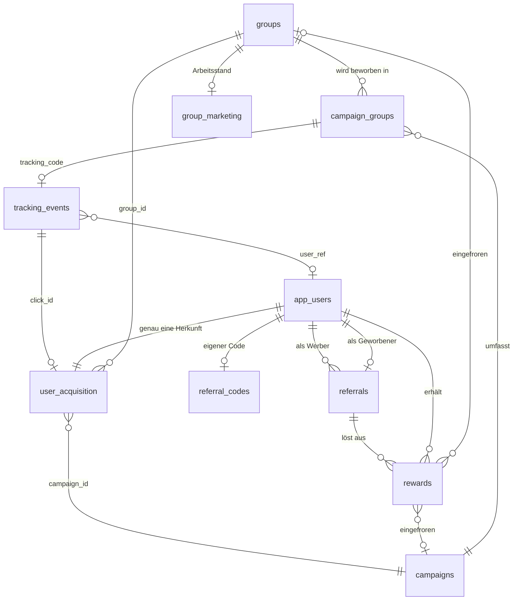
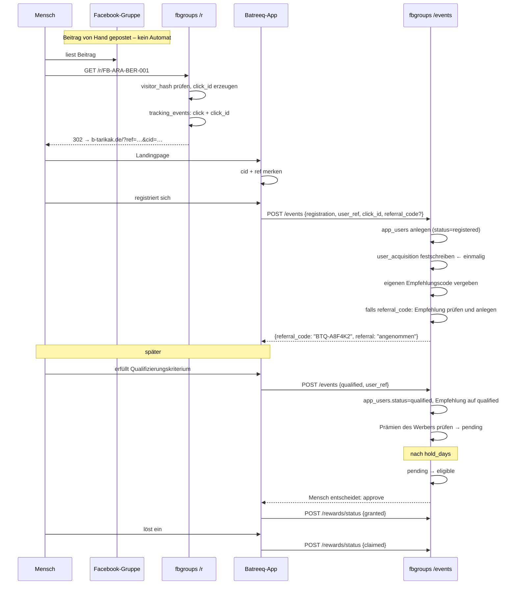

# Akquise → Registrierung → Empfehlung → Qualifizierung → Prämie

**Analyse- und Architekturplan.** Stand: 17.08.2026. Noch nicht umgesetzt.

Dieses Dokument beschreibt, was im Projekt bereits vorhanden ist, was fehlt und
wie die Lücke geschlossen wird, ohne die 310 Gruppen, die 8 Tracking-Codes und
das laufende Tracking anzutasten.

---

## Kurzfassung des Befunds

Die Annahme, das Projekt habe **kein** Referral- und Reward-System, trifft nicht
zu. Beides ist vorhanden und getestet:

| Vorhanden | Ort |
| --- | --- |
| Empfehlungscodes, Empfehlungen, Missbrauchsregeln | `marketing/referral.py`, Tabellen `referral_codes`, `referrals` |
| Prämienregeln, Schwellenwerte, Vergabe | `marketing/rewards.py`, `config/rewards.yaml`, Tabelle `rewards` |
| Tracking-Codes, Klickzählung, Weiterleitung | `marketing/tracking.py`, `marketing/web.py`, Tabelle `campaign_groups` |
| Ereigniskette bis `conversion` | Tabelle `tracking_events`, `marketing/analytics.py` |
| Prüfprotokoll über jede Entscheidung | Tabelle `marketing_audit` |
| Rund 30 Tests dazu | `tests/test_marketing_tracking.py` |

Was **fehlt**, ist die Ebene darunter – und das erklärt die Nullen im Testlauf:

1. **Es gibt keinen Benutzer.** `user_ref` ist eine Freitextspalte in vier
   Tabellen, kein Datensatz. Niemand kann sagen, wie viele Menschen es gibt.
2. **Die Acquisition Source wird nirgends festgeschrieben.** Sie wird bei jeder
   Auswertung neu aus `tracking_events` erraten (`store.erste_zuordnung`) – und
   nur dann, wenn die Batreeq-App den Tracking-Code selbst zurückmeldet.
3. **Ein Klick trägt keine Kennung.** Zwischen dem gezählten Klick und einer
   späteren Registrierung gibt es keine Brücke. Genau hier reißt die Kette.
4. **Die Prämie weiß nicht, woher sie kommt.** `rewards` hat weder
   `campaign_id` noch `group_id` noch einen Verweis auf die auslösende
   Empfehlung. Anforderung 7 ist damit heute nicht erfüllbar.

Dazu zwei Befunde, die vor jeder Prämienvergabe geklärt sein müssen – siehe
[Risiken](#risiken-und-offene-entscheidungen):

- **`POST /events` ist unauthentifiziert und öffentlich erreichbar.**
- **`GET /referral/{user_ref}` gibt ohne Prüfung Fremddaten heraus.**

---

## A) Die bestehende Datenbank

`data/groups.sqlite`, 824 KB, `PRAGMA user_version = 6`, zwölf Tabellen.

| Tabelle | Zeilen | Rolle |
| --- | ---: | --- |
| `groups` | 310 | Gruppenbestand aus der Suche |
| `group_sources` | 2 700 | welche Anfrage welche Gruppe fand |
| `campaigns` | 1 | `batreeq-syrian-germany` |
| `campaign_groups` | 8 | Kampagne ↔ Gruppe **+ Tracking-Code** |
| `group_marketing` | 4 | Arbeitsstand von Hand |
| `tracking_events` | 1 | ein Klick, `FB-ARA-BER-001` |
| `referral_codes` | 0 | – |
| `referrals` | 0 | – |
| `rewards` | 0 | – |
| `marketing_audit` | 10 | Prüfprotokoll |
| `marketing_meta` | 1 | Zufallsschlüssel für `visitor_hash` |
| `runs` | 1 | Importläufe |

Die acht Codes: `FB-ARA-BER-001` … `-005`, `FB-SYR-BER-001` … `-003`, alle zur
Kampagne `batreeq-syrian-germany`, alle mit `https://b-tarikak.de/r/…`.

Zwei Beobachtungen am Rand:

- Die Kampagne steht auf `status = 'draft'`, obwohl ihre Links öffentlich sind.
- Es liegen vier Sicherungskopien neben der Datei (`*.bak-vor-*`). Dieses
  Vorgehen wird für die Migration übernommen.

## B) Modelle und Migrationsverfahren

- `src/fbgroups/models.py` – `Group`, `ImportRun`, `ScoreBreakdown` (Bestand).
- `src/fbgroups/marketing/models.py` – `GroupMarketing`, `Campaign`,
  `CampaignGroup`, `TrackingEvent`, `Referral`, `Reward`, `RewardRule` samt
  Aufzählungen. Alles Pydantic.
- Schema an zwei Stellen: `storage/sqlite_store.py` (`SCHEMA`) und
  `marketing/store.py` (`SCHEMA`, `SCHEMA_TRACKING`). Letztere werden von
  `sqlite_store` importiert, es gibt also **eine** Wahrheit je Tabelle.
- Migration: `_MIGRATIONS: dict[int, tuple[str, ...]]` mit den Schritten 2–5,
  `SCHEMA_VERSION = 6`, rein additiv, `duplicate column name` wird bewusst
  übergangen.

**Fallstrick, der die Erweiterung betrifft:** `MarketingStore.__init__` liest
`user_version` **nicht** und migriert **nicht**. Es führt nur
`CREATE TABLE IF NOT EXISTS` aus – das ergänzt keine Spalte in einer schon
vorhandenen Tabelle. Und `GET /r/{code}` sowie `POST /events` öffnen
ausschließlich den `MarketingStore`. Eine neue Spalte auf `tracking_events`
würde also auf einem Server, der die Datei nie mit `SqliteStore` geöffnet hat,
schlicht fehlen und die Weiterleitung zum Absturz bringen. Der Plan sieht dafür
einen eigenen Schritt vor (Schritt 0 der Baureihenfolge).

## C) Das bestehende Tracking

```
Facebook-Beitrag  →  GET /r/FB-ARA-BER-001
                     ├─ resolve_code()          → campaign_id, group_id
                     ├─ visitor_hash(IP,UA,Tag) → Doppelklickschutz, HMAC, 16 Zeichen
                     ├─ record_event(click)     → tracking_events
                     └─ 302 → {landing_page}?ref=FB-ARA-BER-001
```

Danach endet die Zuständigkeit dieses Projekts. Alles Weitere muss die
Batreeq-App über `POST /events` melden:

```
POST /events  {event_type, user_ref, tracking_code, referral_code, occurred_at}
   ├─ tracking_code vorhanden      → Kampagne + Gruppe direkt
   ├─ sonst: erste_zuordnung(user_ref) → erbt vom ersten Ereignis mit Code
   ├─ bei registration             → Empfehlungscode vergeben, Empfehlung prüfen
   └─ bei registration/qualified/conversion → Empfehlungsstand heben, Prämien prüfen
```

Das ist sauber gebaut. Die Schwachstelle ist nicht die Logik, sondern die
**Übergabe**: Der Klick trägt keine Kennung, deshalb kann `erste_zuordnung`
frühestens beim zweiten Ereignis desselben Benutzers greifen – und nur, wenn
das erste Ereignis den Code mitbrachte. Kommt jemand über einen Facebook-Link
und registriert sich drei Tage später aus dem Verlauf heraus, ist die Herkunft
verloren.

## D) Benutzer- und Registrierungsdaten im Projekt

Keine. `user_ref` existiert als Spalte in `tracking_events`, `referral_codes`,
`referrals` und `rewards`, aber es gibt keine Tabelle, die einen Benutzer
darstellt, keinen Registrierungszeitpunkt, keinen Zustand und keine
Eindeutigkeit über die vier Tabellen hinweg. Aktuell sind alle vier Bestände
leer – der Testlauf hat nur einen Klick erzeugt.

Das bleibt bewusst so eng: keine Namen, keine E-Mail, keine Telefonnummer. Was
neu dazukommt, ist der **Datensatz** zu einer bereits vorhandenen
undurchsichtigen Kennung, nicht eine neue Art von Angabe.

## E) Die Landingpage

**Sie gehört nicht zu diesem Projekt.** `campaigns.landing_page` ist
`https://b-tarikak.de/` – die Batreeq-App, ein eigenes System. Dieses Projekt
liefert nur:

| Weg | Sichtbarkeit | Zweck |
| --- | --- | --- |
| `GET /` | nur localhost | Arbeitsliste über den Gruppenbestand |
| `POST /stand` | nur localhost | Arbeitsstand einer Gruppe setzen |
| `GET /r/{code}` | öffentlich | Klick zählen, weiterleiten |
| `POST /events` | öffentlich, **ungeschützt** | Meldungen der App |
| `GET /referral/{user_ref}` | öffentlich, **ungeschützt** | Empfehlungsstand |
| `GET /healthz` | öffentlich | Lebenszeichen |

Daraus folgt eine Frage, die vor dem Bauen zu klären ist:
`marketing.app_base_url` und `campaigns.landing_page` zeigen **beide** auf
`https://b-tarikak.de/`. Die Weiterleitung schickt den Besucher also auf
`https://b-tarikak.de/?ref=FB-ARA-BER-001`. Wenn dieser Host der FastAPI-Dienst
ist, antwortet `/` von außen mit **404** (Arbeitsliste ist localhost-only). Es
muss also ein Reverse Proxy davor stehen, der `/r/*` und `/events` an diesen
Dienst und `/` an die Batreeq-App gibt. Das ist zu prüfen – der Klick wurde
gezählt, ob die Landung danach funktioniert hat, sagt die Datenbank nicht.

---

## F) Datenmodell

Zwei neue Tabellen, zwei erweiterte, eine neue Spalte. Alles additiv.

### Neu: `app_users` – der Benutzer

Ein Datensatz je undurchsichtiger Kennung aus der Batreeq-App. Beantwortet
„wie viele Menschen", was eine Ereigniszählung nicht kann: Meldet die App eine
Registrierung doppelt, steigt `registrations`, aber nicht `new_users`.

| Spalte | Typ | Bedeutung |
| --- | --- | --- |
| `user_ref` | TEXT PK | undurchsichtige Kennung, nie ein Name |
| `status` | TEXT | `new` → `registered` → `activated` → `qualified` → `converted` |
| `first_seen_at` | TEXT | erstes Ereignis mit dieser Kennung |
| `registered_at` | TEXT NULL | Grundlage für „New Users" |
| `qualified_at` | TEXT NULL | |
| `converted_at` | TEXT NULL | |
| `created_at`, `updated_at` | TEXT | |

`status` folgt `FUNNEL_ORDER` und **fällt nie von selbst zurück** – dieselbe
Regel wie bei `ReferralStatus`. Herabstufen ist Handarbeit.

### Neu: `user_acquisition` – die Herkunft, festgeschrieben

Genau eine Zeile je Benutzer. Nach dem Anlegen unveränderlich; das ist der Kern
von Anforderung 2 und 3.

| Spalte | Typ | Bedeutung |
| --- | --- | --- |
| `user_ref` | TEXT PK, FK | |
| `channel` | TEXT | `facebook_group` / `referral` / `direct` / `unknown` |
| `campaign_id` | TEXT | |
| `group_id` | TEXT | |
| `tracking_code` | TEXT | |
| `click_id` | TEXT | der Klick, aus dem die Zuordnung stammt |
| `referral_code` | TEXT | wenn über eine Empfehlung gekommen |
| `first_click_at` | TEXT NULL | Zeitpunkt jenes Klicks |
| `attributed_by` | TEXT | `click_id` / `tracking_code` / `user_history` / `referral` / `none` |
| `attributed_at` | TEXT | |

`attributed_by` ist keine Verzierung. Es hält fest, **wie sicher** die Zuordnung
ist. Eine über `user_history` geerbte Herkunft ist schwächer belegt als eine
über `click_id`, und wer später eine Prämie prüft, muss das sehen können. Nach
demselben Grundsatz wie im Bestand: es wird nichts erfunden – ohne Beleg steht
dort `none` und `channel = unknown`, kein geratener Wert.

### Neue Spalte: `tracking_events.click_id`

Die Brücke zwischen Klick und Registrierung. Der Redirect erzeugt eine
Zufallskennung, schreibt sie auf das Klick-Ereignis und hängt sie an die
Landing-URL:

```
302 → https://b-tarikak.de/?ref=FB-ARA-BER-001&cid=k7Qp2mXf9NwErT4aZb
```

Die Batreeq-App legt `cid` ab (localStorage oder eigenes Cookie) und schickt sie
bei der Registrierung zurück. Damit ist die Herkunft auch nach Tagen exakt
auflösbar, ohne dass dieses Projekt irgendetwas über den Besucher speichert, was
es nicht ohnehin hätte. `?ref=` bleibt zusätzlich erhalten – die acht
veröffentlichten Links funktionieren unverändert weiter.

**Das ist der einzige Punkt, der eine Änderung in der Batreeq-App verlangt.**
Ohne sie greift nur die schwächere Zuordnung über `tracking_code`.

### Erweitert: `rewards`

Neue Statuswerte laut Anforderung 6 und die fehlende Rückverfolgbarkeit:

| Neue Spalte | Bedeutung |
| --- | --- |
| `referral_id` | die Empfehlung, die die Schwelle gerissen hat |
| `campaign_id`, `group_id` | aus der Herkunft des Benutzers, beim Anlegen eingefroren |
| `eligible_at`, `approved_at`, `granted_at`, `claimed_at` | die Zeitpunkte, die das Dashboard zählt |
| `approved_by` | wer freigegeben hat (Freitext, z. B. `cli:khlel`) |

Der Statuswechsel steht zusätzlich vollständig in `marketing_audit` – die
Zeitstempel sind für die Auswertung da, das Protokoll für die Nachvollziehbarkeit.

**Statusmodell:**

| Status | Bedeutung | Wer setzt ihn |
| --- | --- | --- |
| `pending` | Schwelle erreicht, aber Karenzzeit läuft oder eine beteiligte Empfehlung steht auf `review` | automatisch |
| `eligible` | Karenzzeit vorbei, keine Empfehlung mehr strittig – auszahlbar | automatisch |
| `approved` | ein Mensch hat freigegeben | Hand (`marketing reward approve`) |
| `granted` | die Batreeq-App hat die Leistung eingebucht | App (`POST /rewards/status`) |
| `claimed` | der Benutzer hat sie eingelöst | App |
| `cancelled` | zurückgenommen, mit Grund | Hand |
| `expired` | Leistung verfallen | Hand oder App |

Zwei Regeln:

- **Das System kommt allein bis `eligible`, nicht weiter.** Alles ab `approved`
  ist eine Entscheidung, keine Berechnung. Das ist dieselbe Haltung wie „kein
  Geldbetrag als Prämientyp" in `config/rewards.yaml`.
- **Kein Rückfall.** `pending < eligible < approved < granted < claimed`;
  `cancelled` und `expired` nur von Hand.

Die Karenzzeit ist neu und gehört in `config/rewards.yaml` als `hold_days` je
Regel. Sie ist der eigentliche Missbrauchsschutz eines Empfehlungsprogramms:
Wer fünf Konten anlegt und sofort einlöst, ist ohne Karenzzeit nicht zu
stoppen. Dazu `auto_approve: true|false` je Regel – Vorgabe `false`.

Die Umbenennung kostet keine Daten: `rewards` ist leer. Die Migration bildet
`earned → eligible` und `locked → pending` trotzdem ab, wegen der
Sicherungskopien und anderer Rechner.

### Erweitert: `referrals`

Nur zwei Zeitstempel für die Auswertung: `qualified_at`, `converted_at`.
Struktur und Regeln bleiben unverändert.

### Was ausdrücklich **nicht** dazukommt

Keine Namen, E-Mail-Adressen, Telefonnummern, keine IP-Adressen, keine
Facebook-Mitglieder- oder Profildaten, kein Feld, in das solche Angaben passen
würden. `models.Group` bleibt unangetastet. Die Grenzen aus `CLAUDE.md` gelten
unverändert.

---

## G) Beziehungen



Die Kette aus Anforderung 7 ist damit in beide Richtungen lesbar:

```
Reward → user_ref → user_acquisition → tracking_code → campaign_groups → Gruppe + Kampagne
Gruppe → campaign_groups → tracking_code → user_acquisition → app_users → referrals → rewards
```

**Sonderfall Empfehlungskette.** Kommt ein Benutzer über eine Empfehlung, ist
sein `channel = referral` und seine Gruppe leer – das ist die ehrliche Antwort.
Die **Ursprungsgruppe** (die Gruppe, die den Werber gebracht hat) wird in der
Auswertung über die Kette aufgelöst, nicht in der Tabelle gespeichert, mit
Tiefenbegrenzung 10 und Zyklusschutz. Sonst stünde in `user_acquisition` eine
Gruppe, die diesen Menschen nie gesehen hat.

---

## H) Der vollständige Ablauf



### Reihenfolge der Herkunftsauflösung

Bei jedem Ereignis mit `user_ref`, das noch keine `user_acquisition` hat, in
genau dieser Reihenfolge – die erste greifende gewinnt und wird in
`attributed_by` festgehalten:

1. **`click_id`** → das genaue Klick-Ereignis. Stärkster Beleg.
2. **`tracking_code`** (aus `?ref=`) → Kampagne und Gruppe über `campaign_groups`.
3. **`referral_code`** → `channel = referral`, Werber bekannt.
4. **`erste_zuordnung(user_ref)`** → geerbt aus dem ersten eigenen Ereignis mit Code.
5. **nichts davon** → `channel = unknown`, `attributed_by = none`. Kein Rateversuch.

Danach ist die Herkunft eingefroren. Eine Korrektur ist möglich, aber nur über
einen ausdrücklichen Befehl und mit Eintrag im Prüfprotokoll.

---

## I) Schnittstellen

### Unverändert (die 8 Codes und der laufende Betrieb hängen daran)

| Weg | Änderung |
| --- | --- |
| `GET /healthz` | keine |
| `GET /` | Kacheln und Verlinkung auf die neuen Detailseiten |
| `POST /stand` | keine |
| `GET /r/{code}` | **zusätzlich** `click_id` erzeugen und `&cid=` anhängen. `?ref=` bleibt. Bestehende Links funktionieren unverändert. |

### Erweitert

**`POST /events`** – neues Feld `click_id`, neue Antwortfelder. Alle bisherigen
Felder bleiben gültig, damit die App nicht gleichzeitig umgestellt werden muss.

```jsonc
// Anfrage
{
  "event_type": "registration",
  "user_ref": "user-ahmad",
  "click_id": "k7Qp2mXf9NwErT4aZb",   // neu
  "tracking_code": "FB-ARA-BER-001",  // weiterhin erlaubt
  "referral_code": "BTQ-A8F4K2",
  "occurred_at": null
}
// Antwort
{
  "gespeichert": "registration",
  "referral_code": "BTQ-7HK3M9",
  "referral": "angenommen",
  "acquisition": {                     // neu
    "channel": "facebook_group",
    "campaign_id": "batreeq-syrian-germany",
    "group_id": "arabinberlin",
    "tracking_code": "FB-ARA-BER-001",
    "attributed_by": "click_id"
  },
  "rewards_neu": ["premium_7_tage"]
}
```

**Ab sofort mit Authentifizierung.** Kopfzeile `X-Batreeq-Token`, Wert aus der
Umgebungsvariablen `EVENTS_TOKEN`, Vergleich mit `hmac.compare_digest`, ohne
gültigen Wert `401`. Siehe [Risiken](#risiken-und-offene-entscheidungen).

### Neu

| Weg | Sichtbarkeit | Zweck |
| --- | --- | --- |
| `POST /rewards/status` | Token | App meldet `granted` / `claimed` / `expired` |
| `GET /users/{user_ref}` | Token | Herkunft, Empfehlungen, Prämien für die Profilseite der App |
| `GET /group/{group_id}` | nur localhost | Detailseite (Anforderung 9) |
| `GET /campaign/{campaign_id}` | nur localhost | Detailseite (Anforderung 10) |

`GET /referral/{user_ref}` bekommt dieselbe Token-Pflicht wie `/events` – heute
gibt der Weg zu jeder geratenen Kennung Empfehlungscode und Prämienstand heraus.

### Kennzahlen des Dashboards (Anforderung 8)

Die Definitionen gehören in den Plan, weil zwei Paare davon leicht verwechselt
werden und dann Quoten falsch aussehen:

| Kennzahl | Definition |
| --- | --- |
| Clicks | `tracking_events` mit `event_type = click`, je Besucher und Tag einmal |
| Registrations | **Ereignisse** vom Typ `registration` |
| New Users | **Benutzer** mit `registered_at` im Zeitraum – kann kleiner sein als Registrations |
| Qualified Users | `app_users` mit Stand ≥ `qualified` |
| Referrals | `referrals`, aufgeschlüsselt nach Status |
| Rewards Pending / Granted / Claimed | `rewards` je Status |
| Conversion Rate | drei benannte Quoten: Klick→Registrierung, Registrierung→qualifiziert, Klick→Abschluss |

Für jede Quote gilt weiterhin: **`None` bei Nenner 0**, nicht 0,0 %.

### Detailseite einer Gruppe (Anforderung 9)

Gruppenangaben (Name, URL, Stadt, Zielgruppe, Kategorie, Score mit Begründung,
Arbeitsstand) · Kampagnen, in denen sie steckt · ihre Tracking-Links · Klicks,
Registrierungen, New Users, qualifizierte Benutzer · Empfehlungen von Benutzern
dieser Gruppe · Prämien, die auf sie zurückgehen · Prüfprotokoll zur Gruppe.

### Kampagnenseite (Anforderung 10)

Kampagnenkopf und Status · alle Gruppen mit ihren Codes · je Gruppe die Zahlen
· Trichter der Kampagne · Empfehlungen · Prämien nach Status · Conversion.
Sortiert nach Beitrag zur Kampagne, nicht nach Score – hier zählt, was
tatsächlich Benutzer gebracht hat.

---

## J) Betroffene Dateien

### Neu

| Datei | Inhalt |
| --- | --- |
| `src/fbgroups/marketing/users.py` | `app_users`, `user_acquisition`, Reihenfolge der Herkunftsauflösung, Einfrieren |
| `src/fbgroups/marketing/detail_pages.py` | Gruppen- und Kampagnenseite (`dashboard.py` hat schon 490 Zeilen) |
| `src/fbgroups/marketing/auth.py` | Token-Prüfung für die Wege der App |
| `tests/test_acquisition.py` | Zuordnungsreihenfolge, Einfrieren, `attributed_by` |
| `tests/test_rewards_status.py` | Statusmaschine, Karenzzeit, kein Rückfall |
| `tests/test_detail_pages.py` | beide Seiten, localhost-Grenze |
| `tests/test_events_auth.py` | ohne Token 401, mit Token 200 |
| `tests/test_migration_bestand.py` | 310 Gruppen und 8 Codes überleben die Migration unverändert |

### Geändert

| Datei | Änderung |
| --- | --- |
| `marketing/models.py` | `AppUser`, `UserAcquisition`, `AcquisitionChannel`, `AttributionMethod`; `RewardStatus` neu; `Reward` um sechs Felder |
| `marketing/store.py` | `SCHEMA_USERS`; Methoden für Benutzer, Herkunft, Prämienstatus; `click_id` in `record_event` |
| `storage/sqlite_store.py` | `_MIGRATIONS[6]`, `_MIGRATIONS[7]`, `SCHEMA_VERSION = 8` |
| `marketing/web.py` | `click_id` im Redirect, Token-Prüfung, `POST /rewards/status`, `GET /users/{user_ref}`, zwei Detailseiten |
| `marketing/rewards.py` | Statusmaschine, `hold_days`, `auto_approve`, Herkunft in die Prämie schreiben |
| `marketing/referral.py` | Empfehlung an `app_users` koppeln, Zeitstempel |
| `marketing/analytics.py` | New Users, Qualified Users, Prämien je Status, drei Quoten, Auswertung je Gruppe und Kampagne |
| `marketing/dashboard.py` | neue Kacheln, Verlinkung auf die Detailseiten |
| `marketing/cli.py` | `marketing user show/list`, `marketing reward approve/cancel/list`, `marketing acquisition` |
| `cli.py` | neuer Befehl `migrate` (siehe Schritt 0) |
| `config/settings.yaml` | `marketing.referral`, `marketing.attribution`, `marketing.events_token_env` |
| `config/rewards.yaml` | `hold_days`, `auto_approve` je Regel |
| `.env.example` | `EVENTS_TOKEN` |
| `CLAUDE.md`, `README.md` | die neuen Entwurfsentscheidungen |

### Migrationsschritte

```
6 → 7   app_users, user_acquisition, tracking_events.click_id + Index
7 → 8   rewards: neue Spalten, Statusabbildung (earned→eligible, locked→pending)
        referrals: qualified_at, converted_at
SCHEMA_VERSION = 8
```

Rein additiv, wie alle bisherigen Schritte. Kein Umbau, kein `DROP`, kein
`UPDATE` auf `groups` oder `campaign_groups`.

---

## Baureihenfolge

| Schritt | Inhalt | Warum zuerst |
| --- | --- | --- |
| **0** | `MarketingStore` migriert mit (oder scheitert laut); Sicherungskopie `groups.sqlite.bak-vor-akquise` | Ohne das fehlt auf dem Server die neue Spalte und `/r/` stirbt |
| **1** | Token-Pflicht auf `/events` und `/referral/{user_ref}` | Blockiert alles Weitere – ohne sie ist jede Prämie fälschbar |
| **2** | `app_users`, `user_acquisition`, `click_id`, Auflösungsreihenfolge | Fundament für 3–5 |
| **3** | Prämienstatus, Karenzzeit, Rückverfolgbarkeit | Baut auf 2 auf |
| **4** | Auswertung: neue Kennzahlen je Gruppe und Kampagne | Baut auf 2 und 3 auf |
| **5** | Dashboard-Kacheln, Gruppenseite, Kampagnenseite | Zeigt nur, was 2–4 erzeugen |
| **6** | `CLAUDE.md`, `README.md`, `.env.example` | |

Schritt 1 und 2 sind unabhängig von der Batreeq-App. Erst wenn `cid`
weitergereicht wird, greift die stärkste Zuordnung – bis dahin läuft alles über
`?ref=` und die Vererbung weiter.

---

## Wie der Bestand geschützt wird

Anforderungen 11 und 12 sind der Prüfstein. Vier Maßnahmen:

1. **Sicherungskopie vor der Migration**, wie schon viermal geschehen.
2. **Nur additive Schritte.** Kein `DROP`, kein `ALTER … RENAME`, keine
   Schreiboperation auf `groups`, `campaign_groups` oder `group_marketing`.
3. **Ein Test, der die Wirklichkeit prüft**, nicht nur ein Beispiel:
   `test_migration_bestand.py` migriert eine Kopie der echten Datei und
   behauptet 310 Gruppen, 8 Codes mit exakt diesen Werten, unveränderte
   `tracking_url`, unveränderte Scores.
4. **Tracking-Codes bleiben unberührt.** `add_link` fasst eine bestehende
   Zuordnung nicht an – daran ändert sich nichts. Der Redirect bekommt nur
   einen zusätzlichen Anhang an der Ziel-URL.

Die restlichen Grenzen (14–17) sind durch den Entwurf schon eingehalten: es wird
weiterhin nichts veröffentlicht, nichts bei Facebook abgerufen und keine
Mitglieder- oder Profilangabe gespeichert. Mehrere Kampagnen tragen bereits
strukturell – `campaign_id` steht in jeder beteiligten Tabelle, und
`campaign_groups` erlaubt dieselbe Gruppe in mehreren Kampagnen. Was fehlte, war
die Kampagnenseite, nicht das Modell.

---

## Risiken und offene Entscheidungen

### 1. `POST /events` ist ungeschützt — blockierend

Der Weg nimmt heute von jedem im Internet beliebige `user_ref`-Werte und
Ereignistypen entgegen. Wer die Adresse kennt, kann Registrierungen erfinden,
Empfehlungen auslösen und Prämien erzeugen. Solange `rewards` leer ist und
niemand etwas auszahlt, ist der Schaden gering. **Mit einem Prämiensystem ist
das ein offenes Scheunentor.** Deshalb steht die Token-Prüfung als Schritt 1
vor allem anderen. Später zusätzlich möglich: HMAC-Signatur über den Rumpf mit
Zeitstempel gegen Wiedereinspielung.

### 2. `GET /referral/{user_ref}` gibt Fremddaten heraus

Wer eine Kennung errät, sieht Empfehlungscode und Prämienstand. Gleiche
Behandlung wie 1.

### 3. `click_id` verlangt eine Änderung in der Batreeq-App

Ohne sie bleibt die Zuordnung bei der schwächeren Stufe über `?ref=`. Das ist
die einzige Abhängigkeit außerhalb dieses Projekts.

### 4. Zielhost der Weiterleitung ist zu prüfen

`app_base_url` und `landing_page` zeigen beide auf `https://b-tarikak.de/`, und
`/` dieses Dienstes ist localhost-only. Ein Aufruf ohne Reverse Proxy davor
landet auf 404. Bitte einmal einen echten Klick von einem fremden Gerät
durchspielen und schauen, wo er ankommt.

### 5. `visitor_hash` altert

Der Wert wechselt täglich und ist am Folgetag nutzlos, bleibt aber stehen.
Sobald `click_id` einen Klick mit einem Benutzer verbindet, hängt an dem
Datensatz mehr als vorher. Vorschlag: `visitor_hash` nach sieben Tagen leeren –
kostet nichts und nimmt die Frage vorweg.

### 6. Löschung eines Benutzers

Mit einem Benutzerdatensatz wird ein Löschbegehren beantwortbar und damit auch
fällig. Vorschlag: `marketing user loeschen <user_ref>` entfernt `app_users`,
`user_acquisition`, `referrals` und `rewards` dieser Kennung; Klick- und
Ereigniszahlen bleiben als Summen bestehen, weil dort dann keine Kennung mehr
steht.

### 7. Kampagne steht auf `draft`

`batreeq-syrian-germany` ist `draft`, obwohl ihre acht Links öffentlich sind.
Sobald die Kampagnenseite nach Status filtert, fällt sie heraus. Entweder auf
`active` setzen oder die Seite ohne Statusfilter bauen.

### 8. Bekannt und offen

`mypy` meldet vorbestehend „missing py.typed marker"; mit gesetztem Marker
erscheinen acht ältere Fehler in `report.py` und `importers/manual_seed.py`.
Unabhängig von dieser Erweiterung, aber sie wird dadurch nicht kleiner.
